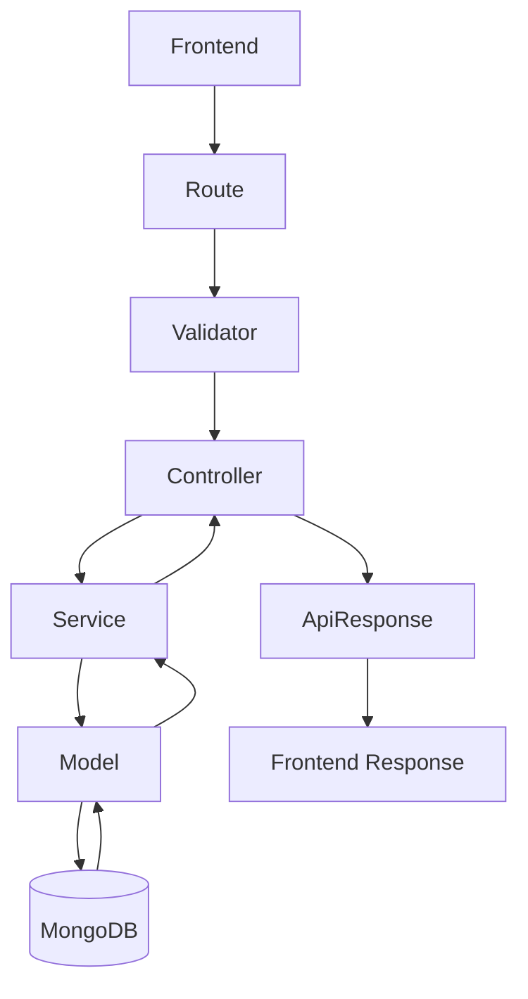
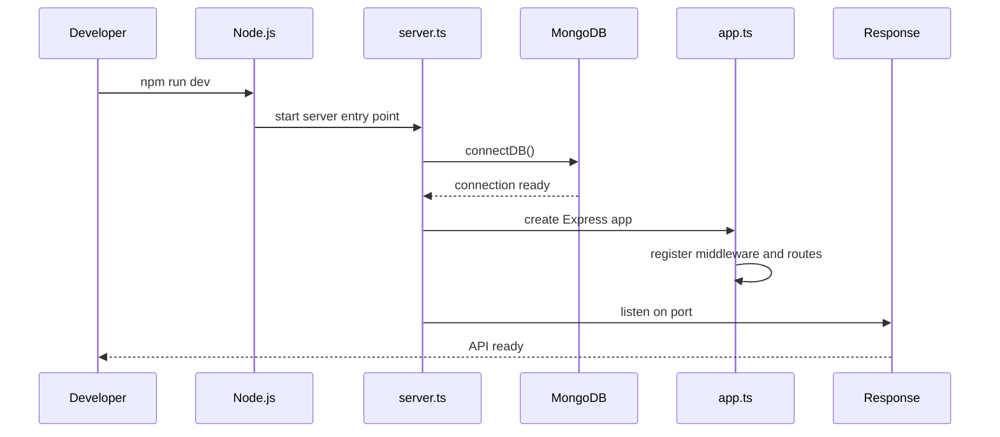
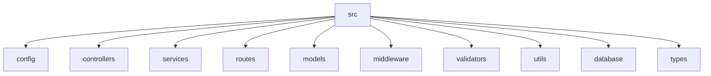
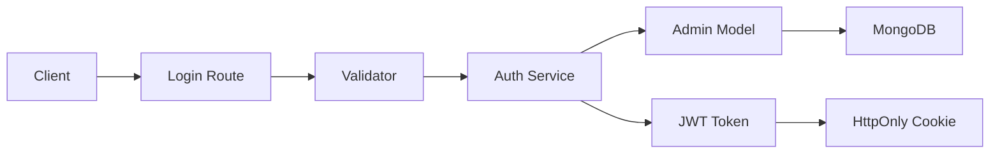
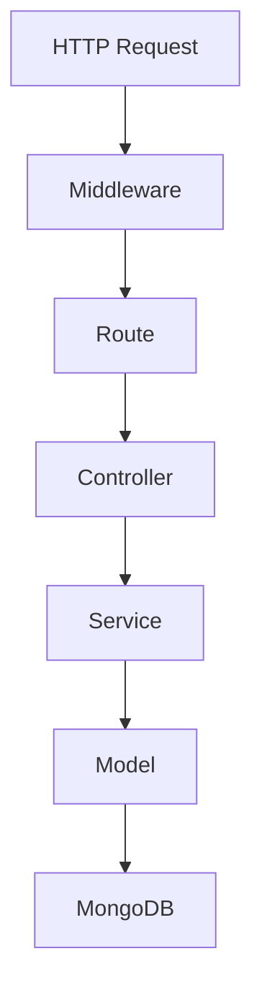
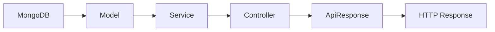

# Backend Architecture Documentation

This document explains the backend of the TechVistar project in a beginner-friendly way while also describing the professional architecture decisions behind it.

> This file documents the current backend implementation in the repository. It is written for learning, onboarding, and codebase understanding.

---

## 1. Project Overview

### What this backend does
This backend is the server-side engine of the TechVistar application. It exposes a REST API that powers:
- admin authentication
- contact form submissions
- newsletter subscriptions
- careers and job listings
- job applications
- service, solution, and project CMS content
- FAQ content for the public website

In simple terms, the frontend sends HTTP requests to this backend, and this backend reads or writes data in MongoDB and sends a JSON response back.

### Overall architecture
The backend is built using a layered architecture:
- Express handles HTTP requests
- Routes define the URLs
- Controllers receive the request and prepare the response
- Services contain the business logic
- Models define the database structure
- MongoDB stores the actual data

This is a modern adaptation of MVC for APIs.

### Design pattern followed
The main design pattern is:
- Layered architecture
- Service layer pattern
- Middleware pipeline pattern
- REST API pattern

Why this is useful:
- controllers stay slim
- business logic is easier to test
- different parts of the app are easier to maintain
- new features can be added without breaking existing ones

### Why TypeScript was chosen
TypeScript adds static types to JavaScript. That means the code can catch mistakes earlier.

Benefits:
- fewer runtime bugs
- better editor autocomplete
- safer refactoring
- clearer code for beginners and teams

Example: if a controller expects an object with an email string, TypeScript can warn you if you accidentally pass the wrong shape.

### Why Express was chosen
Express is a minimal and very popular Node.js web framework.

Benefits:
- easy to learn
- very flexible
- huge ecosystem of middleware
- perfect for building REST APIs

It is a good choice for this project because the backend is relatively simple and needs clear routing and middleware handling.

### Why MongoDB + Mongoose were chosen
MongoDB is a NoSQL database that stores data as JSON-like documents. That fits JavaScript very naturally.

Mongoose is the ODM layer used to define schemas and interact with MongoDB in an organized way.

Why this combination is good:
- flexible document-based storage
- easy integration with Node.js and Express
- schema validation and data modeling
- simpler setup than a full relational database for this content-heavy website backend

---

## 2. Folder Structure

The backend source code is stored inside the src folder. The structure is organized by responsibility.

### src
Purpose:
- the main application source folder

Why it exists:
- keeps all backend code organized in one place

Files inside:
- app.ts
- server.ts

How it interacts with other folders:
- imports configuration, middleware, routes, utilities, and models

Real example:
- server.ts starts the application and app.ts wires the entire middleware and route stack

### src/config
Purpose:
- central configuration for environment variables and database connection

Why it exists:
- keeps configuration separate from business logic

Files inside:
- env.ts
- database.ts

How it interacts with other folders:
- controllers, services, and middleware use env.ts for config values
- server.ts uses database.ts

Real example:
- env.ts reads JWT secrets and MongoDB URL from the environment

### src/constants
Purpose:
- stores shared constants used across the app

Why it exists:
- avoids hardcoding repeated values like status codes and validation rules

Files inside:
- index.ts

How it interacts with other folders:
- controllers, services, validators, middleware, and utils import from here

Real example:
- HTTP_STATUS and ERROR_CODES are used consistently for all responses

### src/controllers
Purpose:
- handles HTTP requests and sends responses

Why it exists:
- separates request handling from business logic

Files inside:
- auth.controller.ts
- contact.controller.ts
- faq.controller.ts
- health.controller.ts
- job.controller.ts
- jobApplication.controller.ts
- newsletter.controller.ts
- project.controller.ts
- service.controller.ts
- solution.controller.ts

How it interacts with other folders:
- receives requests from routes
- calls services
- formats output with ApiResponse

Real example:
- contact.controller.ts validates the request, calls the contact service, and sends a success response

### src/services
Purpose:
- contains the core business logic

Why it exists:
- keeps controllers thin and logic reusable

Files inside:
- auth.service.ts
- contact.service.ts
- faq.service.ts
- job.service.ts
- jobApplication.service.ts
- newsletter.service.ts
- project.service.ts
- service.service.ts
- solution.service.ts

How it interacts with other folders:
- controllers call services
- services use models to interact with MongoDB

Real example:
- job.service.ts creates or updates job listings and checks for duplicate slugs

### src/routes
Purpose:
- maps URLs to controllers

Why it exists:
- keeps URL definitions separate from business logic

Files inside:
- auth.routes.ts
- contact.routes.ts
- faq.routes.ts
- health.routes.ts
- index.ts
- job.routes.ts
- jobApplication.routes.ts
- newsletter.routes.ts
- project.routes.ts
- service.routes.ts
- solution.routes.ts

How it interacts with other folders:
- app.ts mounts these routes under /api
- each route imports a controller

Real example:
- job.routes.ts defines the public and admin routes for jobs

### src/models
Purpose:
- defines MongoDB collections and schemas

Why it exists:
- ensures documents follow a consistent structure

Files inside:
- Admin.ts
- Contact.ts
- FAQ.ts
- Job.ts
- JobApplication.ts
- Newsletter.ts
- Project.ts
- Service.ts
- Solution.ts

How it interacts with other folders:
- services use models to read and write data

Real example:
- the Job model defines fields like title, slug, salary, description, and status

### src/middleware
Purpose:
- runs between the request and the final handler

Why it exists:
- handles cross-cutting concerns such as auth, logging, and errors

Files inside:
- auth.middleware.ts
- errorHandler.ts
- notFound.ts
- requestLogger.ts

How it interacts with other folders:
- app.ts registers the middleware globally

Real example:
- auth.middleware.ts verifies JWTs before protected routes are used

### src/validators
Purpose:
- validates incoming request data before business logic is executed

Why it exists:
- prevents invalid data from reaching the service layer

Files inside:
- auth.validator.ts
- contact.validator.ts
- faq.validator.ts
- job.validator.ts
- jobApplication.validator.ts
- newsletter.validator.ts
- project.validator.ts
- service.validator.ts
- solution.validator.ts

How it interacts with other folders:
- controllers call these validators before calling services

Real example:
- validateContactInput checks that email and message are present and correctly formatted

### src/database
Purpose:
- contains seed scripts to populate initial data

Why it exists:
- makes it easier to initialize the database with sample content

Files inside:
- seedAdmin.ts
- seedFaqs.ts
- seedPortfolio.ts
- seedServices.ts
- seedSolutions.ts

How it interacts with other folders:
- uses the models to insert initial records

Real example:
- seedAdmin.ts creates a default admin account for authentication testing

### src/utils
Purpose:
- reusable helper functions and shared utilities

Why it exists:
- avoids duplication and centralizes common behavior

Files inside:
- ApiError.ts
- ApiResponse.ts
- auth.utils.ts
- logger.ts

How it interacts with other folders:
- controllers and services import these helpers

Real example:
- ApiResponse.success() formats all successful API responses consistently

### src/types
Purpose:
- shared TypeScript interfaces, types, and Express augmentation

Why it exists:
- gives consistency to the codebase and improves type safety

Files inside:
- common.ts
- express.d.ts

How it interacts with other folders:
- used across controllers, services, models, and middleware

Real example:
- JwtPayload defines the structure of JWT contents

### src/interfaces
Purpose:
- holds interfaces for application data structures

Why it exists:
- keeps models and services consistent

Files inside:
- currently no specific feature interfaces implemented beyond shared types

How it interacts with other folders:
- intended for future domain-level typing

Real example:
- future DTOs or request/response payload interfaces can be placed here

### src/constants
Purpose:
- project-wide constants

Why it exists:
- avoids magic strings and magic numbers

Files inside:
- index.ts

Real example:
- constants define HTTP status codes and validation patterns

---

## 3. Request Flow

A request in this backend follows a predictable path.



### Step-by-step example: contact form submission
1. The frontend sends a POST request to /api/contact.
2. Express matches the route.
3. The contact validator checks the body.
4. The controller receives the validated data.
5. The service saves the data.
6. The model writes the document to MongoDB.
7. The service returns the created record.
8. The controller sends a JSON success response.

### Step-by-step example: admin login
1. The frontend sends a login request.
2. The auth route receives it.
3. Validator ensures email and password are present.
4. Controller calls the auth service.
5. The service checks the admin account and compares the password.
6. If valid, JWTs are created.
7. The access token is stored in an HttpOnly cookie.
8. The client receives a success response.

### Error flow
If something goes wrong:
- a validator can throw a validation error
- a service can throw an ApiError
- the global error middleware catches it and formats the response

---

## 4. Every File Explanation

### Entry Files

#### src/server.ts
Purpose:
- application entry point

Why it exists:
- starts the server and manages startup and shutdown lifecycle

Functions inside:
- starts the app
- connects to MongoDB
- registers graceful shutdown handlers

Imports:
- dotenv/config
- app
- env
- database helpers
- logger

Exports:
- no exports; it runs the server

Role:
- infrastructure/startup file

#### src/app.ts
Purpose:
- builds the Express application and installs middleware

Why it exists:
- centralizes the request pipeline

Functions inside:
- sets up CORS, Helmet, compression, cookie parsing, logging, body parsers, and routes

Imports:
- express, cors, helmet, compression, cookie-parser
- route and middleware modules

Exports:
- default Express app

Role:
- application wiring file

### Configuration Files

#### src/config/env.ts
Purpose:
- loads and validates environment variables

Why it exists:
- avoids scattered process.env usage across the app

Functions inside:
- required()
- optional()
- optionalInt()

Imports:
- none

Exports:
- env object

Role:
- configuration layer

#### src/config/database.ts
Purpose:
- manages the MongoDB connection lifecycle

Why it exists:
- keeps database setup out of the server file

Functions inside:
- connectDB()
- disconnectDB()
- getDbStatus()

Imports:
- mongoose
- env
- logger
- constants

Exports:
- connectDB, disconnectDB, getDbStatus

Role:
- database infrastructure

### Middleware Files

#### src/middleware/auth.middleware.ts
Purpose:
- verifies JWT access tokens for protected routes

Why it exists:
- ensures only authenticated admins can access protected endpoints

Functions inside:
- authMiddleware()

Imports:
- express types, jsonwebtoken, env, ApiError, JwtPayload

Exports:
- authMiddleware

Role:
- authentication middleware

#### src/middleware/errorHandler.ts
Purpose:
- catches and formats errors globally

Why it exists:
- ensures every error response looks consistent

Functions inside:
- errorHandler()

Imports:
- express, mongoose, ApiError, logger

Exports:
- errorHandler

Role:
- error handling middleware

#### src/middleware/notFound.ts
Purpose:
- handles unknown routes

Why it exists:
- returns a standard 404 response instead of a generic Express failure

Functions inside:
- notFound()

Imports:
- express, ApiError, constants

Exports:
- notFound

Role:
- 404 middleware

#### src/middleware/requestLogger.ts
Purpose:
- logs incoming requests

Why it exists:
- helps with debugging and monitoring

Functions inside:
- requestLogger middleware

Imports:
- morgan, logger, env

Exports:
- requestLogger

Role:
- logging middleware

### Routes and Controllers

#### src/routes/index.ts
Purpose:
- mounts all feature routers under /api

Why it exists:
- keeps the main app file simple and centralizes route organization

Functions inside:
- API root route
- rate-limiting setup
- route mounting

Imports:
- express, rate-limit, all feature routers, constants

Exports:
- router

Role:
- root router

#### src/routes/auth.routes.ts
Purpose:
- defines auth endpoints

Why it exists:
- keeps authentication routes separate from other features

Functions inside:
- route registration

Imports:
- Router, authController

Exports:
- router

Role:
- routing

#### src/controllers/auth.controller.ts
Purpose:
- handles login, me, and logout endpoints

Why it exists:
- translates HTTP requests into service calls

Functions inside:
- login()
- me()
- logout()

Imports:
- express, jsonwebtoken, env, ApiResponse, authService, validator, JwtPayload, auth utils

Exports:
- authController

Role:
- controller

#### src/services/auth.service.ts
Purpose:
- performs login, token signing, and logout logic

Why it exists:
- separates auth business logic from HTTP flow

Functions inside:
- login()
- getAdminById()
- logout()
- logoutByRefreshToken()
- verifyAccessToken()
- signToken()

Imports:
- bcrypt, jsonwebtoken, env, Admin, ApiError, JwtPayload

Exports:
- authService

Role:
- business logic

### Health and General Routes

#### src/routes/health.routes.ts
Purpose:
- exposes the health endpoint

Why it exists:
- allows monitoring and uptime checks

Functions inside:
- route registration

Imports:
- Router, healthCheck

Exports:
- router

Role:
- routing

#### src/controllers/health.controller.ts
Purpose:
- returns health information about the backend

Why it exists:
- helps with deployment monitoring and debugging

Functions inside:
- healthCheck()
- formatUptime()
- maskUri()

Imports:
- express, os, ApiResponse, getDbStatus, env, constants

Exports:
- healthCheck

Role:
- controller

### Contact Module

#### src/routes/contact.routes.ts
Purpose:
- exposes the contact form endpoint

Why it exists:
- keeps public contact submission separate from other modules

Functions inside:
- route registration with rate limiting

Imports:
- express, rate-limit, controller, constants

Exports:
- router

Role:
- routing

#### src/controllers/contact.controller.ts
Purpose:
- handles contact form submission requests

Why it exists:
- keeps HTTP concerns separate from persistence logic

Functions inside:
- submitContactForm()

Imports:
- express, validator, service, ApiResponse, constants

Exports:
- submitContactForm

Role:
- controller

#### src/services/contact.service.ts
Purpose:
- saves contact inquiries to MongoDB

Why it exists:
- centralizes contact business logic

Functions inside:
- createContact()

Imports:
- Contact model, logger

Exports:
- contactService

Role:
- business logic

#### src/models/Contact.ts
Purpose:
- defines the contact form schema

Why it exists:
- ensures contact submissions follow a known structure

Functions inside:
- schema definition and indexes

Imports:
- mongoose, BaseDocument, constants

Exports:
- Contact model

Role:
- database model

### Newsletter Module

#### src/routes/newsletter.routes.ts
Purpose:
- exposes newsletter subscription routes

Why it exists:
- keeps newsletter endpoints isolated

Functions inside:
- route registration

Imports:
- express, rate-limit, controller, constants

Exports:
- router

Role:
- routing

#### src/controllers/newsletter.controller.ts
Purpose:
- handles newsletter subscription requests

Why it exists:
- separates request handling from subscription logic

Functions inside:
- subscribeNewsletter()
- listSubscribers()
- unsubscribeNewsletter()
- deleteSubscriber()

Imports:
- express, validator, service, ApiResponse, ApiError, constants

Exports:
- controller functions

Role:
- controller

#### src/services/newsletter.service.ts
Purpose:
- manages newsletter subscriptions

Why it exists:
- implements duplicate prevention and resubscription rules

Functions inside:
- subscribe()
- getAllSubscribers()
- unsubscribeEmail()
- deleteSubscriber()

Imports:
- Newsletter model, ApiError, logger

Exports:
- newsletterService

Role:
- business logic

#### src/models/Newsletter.ts
Purpose:
- defines newsletter schema

Why it exists:
- stores and validates subscriber documents

Functions inside:
- schema and index definition

Imports:
- mongoose, BaseDocument, constants

Exports:
- Newsletter model

Role:
- database model

### Careers Module

#### src/routes/job.routes.ts
Purpose:
- exposes public and admin job routes

Why it exists:
- keeps job-related endpoints isolated

Functions inside:
- route registration

Imports:
- Router, controller functions

Exports:
- router

Role:
- routing

#### src/controllers/job.controller.ts
Purpose:
- handles job CRUD endpoints

Why it exists:
- keeps the route layer thin

Functions inside:
- createJob()
- listJobs()
- getJobBySlug()
- updateJob()
- updateJobStatus()
- deleteJob()

Imports:
- express, validator, service, ApiResponse, constants, ApiError

Exports:
- controller functions

Role:
- controller

#### src/services/job.service.ts
Purpose:
- performs job CRUD and slug logic

Why it exists:
- centralizes business logic

Functions inside:
- createJob()
- updateJob()
- deleteJob()
- getAllJobs()
- getJobBySlug()
- getFeaturedJobs()
- updateStatus()

Imports:
- Job model, ApiError, logger

Exports:
- jobService

Role:
- business logic

#### src/models/Job.ts
Purpose:
- defines the job listing schema

Why it exists:
- ensures job documents are consistent

Functions inside:
- schema definition and pre-validation slug generation

Imports:
- mongoose, BaseDocument, constants

Exports:
- Job model

Role:
- database model

#### src/routes/jobApplication.routes.ts
Purpose:
- exposes job application routes

Why it exists:
- separates application endpoints from jobs

Functions inside:
- route registration

Imports:
- Router, controller

Exports:
- router

Role:
- routing

#### src/controllers/jobApplication.controller.ts
Purpose:
- handles job application requests

Why it exists:
- isolates request parsing from service logic

Functions inside:
- submitApplication()
- getApplicationById()
- getApplicationsByJob()
- updateApplicationStatus()
- deleteApplication()

Imports:
- express, validator, service, ApiResponse, constants, ApiError

Exports:
- controller functions

Role:
- controller

#### src/services/jobApplication.service.ts
Purpose:
- validates job application domain rules

Why it exists:
- enforces duplicate prevention and job existence checks

Functions inside:
- submitApplication()
- getApplicationById()
- getApplicationsByJob()
- updateApplicationStatus()
- deleteApplication()

Imports:
- JobApplication model, Job model, ApiError, logger

Exports:
- jobApplicationService

Role:
- business logic

#### src/models/JobApplication.ts
Purpose:
- defines the job application schema

Why it exists:
- stores applications with validation and relationship to jobs

Functions inside:
- schema definition and indexes

Imports:
- mongoose, BaseDocument, constants

Exports:
- JobApplication model

Role:
- database model

### Services, Solutions, Projects, and FAQs Modules

#### src/routes/service.routes.ts
Purpose:
- exposes service CMS routes

Why it exists:
- keeps service content endpoints separate

Functions inside:
- route registration

Imports:
- Router, controller functions

Exports:
- router

Role:
- routing

#### src/controllers/service.controller.ts
Purpose:
- handles public and admin service content requests

Why it exists:
- keeps HTTP concerns separate from CMS logic

Functions inside:
- getPublicServices()
- getPublicServiceBySlug()
- adminCreateService()
- adminUpdateService()
- adminDeleteService()

Imports:
- express, validator, service, ApiResponse, constants

Exports:
- controller functions

Role:
- controller

#### src/services/service.service.ts
Purpose:
- manages service CMS CRUD and slug handling

Why it exists:
- centralizes the rules for services

Functions inside:
- createService()
- updateService()
- deleteService()
- getActiveServices()
- getServiceBySlug()

Imports:
- Service model, ApiError, logger

Exports:
- serviceService

Role:
- business logic

#### src/models/Service.ts
Purpose:
- defines the service CMS schema

Why it exists:
- stores rich content for service pages

Functions inside:
- schema definition and indexes

Imports:
- mongoose, BaseDocument

Exports:
- Service model

Role:
- database model

#### src/routes/solution.routes.ts
Purpose:
- exposes solution routes

Why it exists:
- separates solution CMS endpoints from other modules

Functions inside:
- route registration

Imports:
- Router, controller functions

Exports:
- router

Role:
- routing

#### src/controllers/solution.controller.ts
Purpose:
- handles public and admin solution requests

Why it exists:
- keeps controller responsibilities focused

Functions inside:
- getPublicSolutions()
- getPublicSolutionBySlug()
- adminCreateSolution()
- adminUpdateSolution()
- adminDeleteSolution()

Imports:
- express, validator, service, ApiResponse, constants

Exports:
- controller functions

Role:
- controller

#### src/services/solution.service.ts
Purpose:
- manages solution CRUD and slug generation

Why it exists:
- isolates solution domain logic

Functions inside:
- createSolution()
- updateSolution()
- deleteSolution()
- getActiveSolutions()
- getSolutionBySlug()

Imports:
- Solution model, ApiError, logger

Exports:
- solutionService

Role:
- business logic

#### src/models/Solution.ts
Purpose:
- defines the solution CMS schema

Why it exists:
- stores structured solution content for the public website

Functions inside:
- schema definition and indexes

Imports:
- mongoose, BaseDocument

Exports:
- Solution model

Role:
- database model

#### src/routes/project.routes.ts
Purpose:
- exposes portfolio/project routes

Why it exists:
- keeps portfolio content endpoints organized

Functions inside:
- route registration

Imports:
- Router, controller functions

Exports:
- router

Role:
- routing

#### src/controllers/project.controller.ts
Purpose:
- handles portfolio project requests

Why it exists:
- keeps route handling and business logic separated

Functions inside:
- getPublicProjects()
- getPublicProjectBySlug()
- adminCreateProject()
- adminUpdateProject()
- adminDeleteProject()

Imports:
- express, validator, service, ApiResponse, constants

Exports:
- controller functions

Role:
- controller

#### src/services/project.service.ts
Purpose:
- manages project CRUD and lookup

Why it exists:
- centralizes portfolio logic

Functions inside:
- createProject()
- updateProject()
- deleteProject()
- getActiveProjects()
- getProjectBySlug()

Imports:
- ProjectModel, ApiError, logger

Exports:
- projectService

Role:
- business logic

#### src/models/Project.ts
Purpose:
- defines the portfolio project schema

Why it exists:
- stores project metadata and content

Functions inside:
- schema definition and indexes

Imports:
- mongoose, BaseDocument

Exports:
- ProjectModel

Role:
- database model

#### src/routes/faq.routes.ts
Purpose:
- exposes FAQ routes

Why it exists:
- keeps FAQ-related endpoints separate from other content modules

Functions inside:
- route registration

Imports:
- Router, controller functions

Exports:
- router

Role:
- routing

#### src/controllers/faq.controller.ts
Purpose:
- handles FAQ public and admin requests

Why it exists:
- keeps FAQ logic separate from the business layer

Functions inside:
- getPublicFAQs()
- getPublicFAQById()
- adminCreateFAQ()
- adminUpdateFAQ()
- adminDeleteFAQ()
- adminHideFAQ()
- adminUpdateFAQOrder()

Imports:
- express, validator, service, ApiResponse, constants

Exports:
- controller functions

Role:
- controller

#### src/services/faq.service.ts
Purpose:
- manages retrieval and CRUD for FAQ documents

Why it exists:
- isolates FAQ domain logic

Functions inside:
- getActiveFAQs()
- getFAQById()
- createFAQ()
- updateFAQ()
- deleteFAQ()
- hideFAQ()
- updateDisplayOrder()

Imports:
- FAQModel, ApiError, logger

Exports:
- faqService

Role:
- business logic

#### src/models/FAQ.ts
Purpose:
- defines the FAQ schema

Why it exists:
- stores question-answer content and CMS metadata

Functions inside:
- schema definition and indexes

Imports:
- mongoose, BaseDocument

Exports:
- FAQModel

Role:
- database model

### Utilities and Types

#### src/utils/ApiError.ts
Purpose:
- custom error class for expected API failures

Why it exists:
- makes error handling clean and consistent

Functions inside:
- constructor and static factory methods such as notFound(), unauthorized(), validationError()

Imports:
- constants

Exports:
- ApiError

Role:
- utility

#### src/utils/ApiResponse.ts
Purpose:
- standardizes successful API responses

Why it exists:
- makes response formats consistent across the app

Functions inside:
- success()
- paginated()
- buildPagination()
- noContent()

Imports:
- express, constants

Exports:
- ApiResponse, PaginationMeta, SuccessResponseBody

Role:
- utility

#### src/utils/auth.utils.ts
Purpose:
- converts token expiry strings into milliseconds

Why it exists:
- helps set cookie expiration times correctly

Functions inside:
- parseExpiryToMs()

Imports:
- none

Exports:
- parseExpiryToMs

Role:
- utility

#### src/utils/logger.ts
Purpose:
- provides structured logging

Why it exists:
- helps debug runtime issues and monitor the app

Functions inside:
- logger instance
- morganStream
- setupProcessLogger()

Imports:
- path, winston, env

Exports:
- logger, morganStream, setupProcessLogger

Role:
- utility

#### src/types/common.ts
Purpose:
- shared interfaces and types

Why it exists:
- reduces duplication and improves consistency

Functions inside:
- type definitions only

Imports:
- mongoose

Exports:
- BaseDocument, PaginationOptions, PaginatedResult, ApiSuccessResponse, ApiErrorResponse, JwtPayload, UserRole, IRepository

Role:
- typing support

#### src/types/express.d.ts
Purpose:
- extends Express Request types with custom properties like req.user

Why it exists:
- enables typed access to auth data in controllers and middleware

Functions inside:
- none; declaration merging only

Imports:
- common types

Exports:
- none

Role:
- TypeScript augmentation

### Database Seed Scripts

#### src/database/seedAdmin.ts
Purpose:
- creates a default admin account

Why it exists:
- simplifies local testing of authentication

Functions inside:
- seedAdmin()

Imports:
- mongoose, dotenv, path, Admin model

Exports:
- none

Role:
- database seeding

#### src/database/seedFaqs.ts
Purpose:
- seeds FAQ content into MongoDB

Why it exists:
- populates the content database from the frontend data structure

Functions inside:
- seed()

Imports:
- mongoose, dotenv, path, FAQModel

Exports:
- none

Role:
- database seeding

#### src/database/seedServices.ts
Purpose:
- seeds service content into MongoDB

Why it exists:
- allows the CMS data to be stored and served from the backend

Functions inside:
- seed script logic

Imports:
- mongoose, dotenv, path, Service model

Exports:
- none

Role:
- database seeding

#### src/database/seedSolutions.ts
Purpose:
- seeds solution content into MongoDB

Why it exists:
- populates solution CMS data

Imports:
- mongoose, dotenv, path, Solution model

Exports:
- none

Role:
- database seeding

#### src/database/seedPortfolio.ts
Purpose:
- seeds portfolio project content

Why it exists:
- populates project data for the public portfolio pages

Imports:
- mongoose, dotenv, path, ProjectModel

Exports:
- none

Role:
- database seeding

---

## 5. API Documentation

The backend uses a REST-style API. All routes are mounted under /api.

### GET /api
Purpose:
- returns basic API information

Method:
- GET

Authentication:
- none

Response:
- JSON object with name, version, status, health route, and timestamp

### GET /api/health
Purpose:
- health check endpoint

Method:
- GET

Authentication:
- none

Response:
- status, environment, uptime, database status, and system data

### POST /api/contact
Purpose:
- submits a new contact form inquiry

Body:
- name
- email
- phone
- company
- serviceInterested
- budget
- message

Validation:
- required fields
- email pattern check
- phone pattern check
- message length check

Response:
- 201 Created with the contact document

Example request:
```json
{
  "name": "Aditya",
  "email": "aditya@example.com",
  "phone": "+91 9876543210",
  "serviceInterested": "web-development",
  "message": "Hello, I would like to discuss a project."
}
```

Example response:
```json
{
  "success": true,
  "statusCode": 201,
  "message": "Thank you for contacting us. Your message has been received.",
  "data": {
    "_id": "...",
    "status": "new"
  }
}
```

Implemented in:
- routes/contact.routes.ts
- controllers/contact.controller.ts
- services/contact.service.ts

### POST /api/newsletter
Purpose:
- subscribes a new email address

Body:
- email
- source

Validation:
- email format
- valid source

Response:
- 201 Created with the new subscriber document

Example request:
```json
{
  "email": "subscriber@example.com",
  "source": "footer"
}
```

### GET /api/careers/jobs
Purpose:
- returns active job listings

Query params:
- status
- department
- featured

Response:
- array of job documents

### GET /api/careers/jobs/:slug
Purpose:
- retrieves a single job by slug

### POST /api/careers/jobs
Purpose:
- creates a new job posting

Body:
- title, slug, department, location, employmentType, experience, salary, description, requirements, responsibilities, benefits, status, featured, applicationDeadline

### PUT /api/careers/jobs/:id
Purpose:
- updates a job posting

### PATCH /api/careers/jobs/:id/status
Purpose:
- changes the status of a job posting

### DELETE /api/careers/jobs/:id
Purpose:
- deletes a job posting

### POST /api/careers/apply
Purpose:
- submits a new job application

Body:
- jobId
- fullName
- email
- phone
- currentLocation
- yearsOfExperience
- linkedin
- portfolio
- resumeUrl
- coverLetter
- whyJoinTechVistar

### GET /api/careers/applications/:id
Purpose:
- retrieves a single application by ID

### GET /api/careers/jobs/:jobId/applications
Purpose:
- lists all applications for one job

### PATCH /api/careers/applications/:id/status
Purpose:
- updates an application status

### DELETE /api/careers/applications/:id
Purpose:
- deletes an application

### GET /api/services
Purpose:
- returns active services

### GET /api/services/:slug
Purpose:
- returns one active service by slug

### POST /api/services/admin
Purpose:
- creates a service entry

### PUT /api/services/admin/:id
Purpose:
- updates a service entry

### DELETE /api/services/admin/:id
Purpose:
- deletes a service entry

### GET /api/solutions
Purpose:
- returns active solutions

### GET /api/solutions/:slug
Purpose:
- returns one active solution by slug

### POST /api/solutions/admin
Purpose:
- creates a solution entry

### PUT /api/solutions/admin/:id
Purpose:
- updates a solution entry

### DELETE /api/solutions/admin/:id
Purpose:
- deletes a solution entry

### GET /api/portfolio
Purpose:
- returns active portfolio projects

### GET /api/portfolio/:slug
Purpose:
- returns one project by slug

### POST /api/portfolio/admin
Purpose:
- creates a portfolio project entry

### PUT /api/portfolio/admin/:id
Purpose:
- updates a portfolio project entry

### DELETE /api/portfolio/admin/:id
Purpose:
- deletes a portfolio project entry

### GET /api/faqs
Purpose:
- returns active FAQs sorted by display order

### GET /api/faqs/:faqId
Purpose:
- returns one FAQ by faqId

### POST /api/faqs/admin
Purpose:
- creates a FAQ entry

### PUT /api/faqs/admin/:id
Purpose:
- updates a FAQ entry

### DELETE /api/faqs/admin/:id
Purpose:
- deletes a FAQ entry

### PATCH /api/faqs/admin/:id/hide
Purpose:
- hides a FAQ without deleting it

### PATCH /api/faqs/admin/:id/order
Purpose:
- updates display order for a FAQ

### GET /api/auth/me
Purpose:
- returns the currently authenticated admin, if any

### POST /api/auth/login
Purpose:
- authenticates an admin

Body:
- email
- password

Response:
- admin details and success message

### POST /api/auth/logout
Purpose:
- logs the current admin out

---

## 6. Models

### Admin model
File:
- src/models/Admin.ts

Purpose:
- stores admin credentials for authentication

Fields:
- name: string, required
- email: string, required, unique
- password: string, required, hashed by bcrypt
- role: admin only
- refreshTokenHash: optional, stores a hashed refresh token

Validation:
- email format check
- password minimum length
- name length checks

Default values:
- role defaults to admin

Timestamps:
- createdAt and updatedAt are enabled

Hooks:
- pre-save hook hashes the password before saving

Indexes:
- email is unique

Relationship:
- no relationships with other collections in this implementation

### Contact model
Purpose:
- stores contact form submissions

Fields:
- name, email, phone, company, serviceInterested, budget, message, status

Validation:
- required name, email, phone, message
- service enum
- email regex and phone regex

Default values:
- status defaults to new

Indexes:
- status and createdAt

### FAQ model
Purpose:
- stores FAQ content for the public site

Fields:
- faqId, question, answer, category, page, tags, featured, status, displayOrder, seoTitle, seoDescription

Validation:
- faqId unique
- category and page enums

Default values:
- status active
- displayOrder 0

Indexes:
- status + displayOrder
- category + status

### Job model
Purpose:
- stores job postings

Fields:
- title, slug, department, location, employmentType, experience, salary, description, requirements, responsibilities, benefits, status, featured, applicationDeadline

Validation:
- enums for department, employmentType, status
- required fields for title, slug, description, etc.

Default values:
- salary Competitive
- status draft
- featured false

Hooks:
- pre-validate generates a slug from the title when one is not provided

Indexes:
- status + featured
- department
- status + createdAt

### JobApplication model
Purpose:
- stores applications submitted for jobs

Fields:
- jobId (ObjectId reference to Job)
- fullName, email, phone, currentLocation, yearsOfExperience, linkedin, portfolio, resumeUrl, coverLetter, whyJoinTechVistar, status

Validation:
- jobId required and must be a valid ObjectId
- required applicant fields
- minimum cover letter length

Default values:
- resumeUrl placeholder if missing
- status Pending

Relationships:
- jobId references the Job model

Indexes:
- unique index on email + jobId
- jobId
- status
- createdAt

### Newsletter model
Purpose:
- stores newsletter subscribers

Fields:
- email, status, source

Validation:
- unique email
- email regex
- source enum

Default values:
- status subscribed
- source footer

Indexes:
- status

### Project model
Purpose:
- stores portfolio project items

Fields:
- title, slug, description, thumbnail, category, technologies, liveUrl, githubUrl, featured, date, client, role, longDescription, keyFeatures, challenges, gallery, tags, status, serviceSlugs, industry, updatedDate, displayOrder, seoTitle, seoDescription

Validation:
- several required fields

Hooks:
- pre-validate slug generation

Indexes:
- status + displayOrder

### Service model
Purpose:
- stores rich service CMS content

Fields:
- title, slug, shortDescription, fullDescription, icon, coverImage, features, technologies, benefits, displayOrder, status, seoTitle, seoDescription, category, thumbnail, overview, offerings, process, caseStudies, cta, featured, industries, whyChooseUs, stats, detailedOfferings, dashboardImage

Validation:
- many required fields for the CMS content model

Hooks:
- pre-validate slug generation

Indexes:
- status + displayOrder

### Solution model
Purpose:
- stores detailed solution content for the website

Fields:
- title, slug, subtitle, icon, category, challenges, ourSolution, features, howItWorks, benefits, industries, techStack, metrics, faqs, status, displayOrder

Validation:
- required nested objects and arrays

Hooks:
- pre-validate slug generation

Indexes:
- status + displayOrder

### ObjectId and timestamps
Every Mongoose model uses:
- _id as a unique ObjectId
- createdAt and updatedAt timestamps

This helps with auditing and ordering records.

---

## 7. Authentication

### Authentication flow
The authentication system currently supports admin login and protected route preparation.

### Admin login
The flow is:
1. client sends email and password
2. validator checks input
3. controller forwards request to auth service
4. service finds the admin by email
5. bcrypt compares the submitted password with the stored hash
6. if valid, the service signs a JWT
7. the access token is sent to the client in an HttpOnly cookie

### bcrypt
bcrypt is used to hash passwords before storing them.

Why it is needed:
- passwords should never be stored as plain text
- hashing makes the database safer if it is compromised

### Password hashing
The Admin model uses a pre-save hook that runs bcrypt.hash() before saving a password.

### JWT
JWT is used to identify an authenticated admin after login.

It contains claims such as:
- sub: the admin id
- email
- role

### Access token
The access token is used as the main authentication credential for the session.

### Refresh token
A refresh token is also generated and stored as a hash in the admin document.

### Cookies
The access token is stored in a cookie with these settings:
- httpOnly: true
- secure: true in production
- sameSite: lax or none depending on environment

This improves security because the browser cannot read the token using JavaScript.

### HttpOnly
HttpOnly cookies are safer because they are not accessible to client-side scripts.

### Protected route
The auth middleware checks whether the request contains a valid token. If the token is missing or invalid, access is denied.

### Middleware
The middleware reads from:
- the accessToken cookie
- or the Authorization header if present

### Authorization header
The project is designed to support Authorization: Bearer <token> as a fallback option.

### Cookie authentication
The current login flow uses cookie-based access token authentication.

### Logout
Logout clears the access token cookie and clears the refresh token hash from the database.

### Seed admin
The seedAdmin script creates a default admin account so authentication can be tested immediately.

---

## 8. Middleware

### Helmet
Purpose:
- adds security headers to responses

Why it is used:
- protects against common web vulnerabilities

### CORS
Purpose:
- allows the frontend to communicate with the backend

Why it is used:
- the frontend and backend may run on different ports or domains

### Morgan
Purpose:
- logs incoming requests

Why it is used:
- helps with debugging and request monitoring

### Compression
Purpose:
- compresses responses before sending them

Why it is used:
- reduces payload size and improves performance

### Cookie Parser
Purpose:
- parses cookies from incoming requests

Why it is used:
- required for JWT cookie authentication

### Rate Limiter
Purpose:
- limits repeated requests from the same IP

Why it is used:
- protects public endpoints against abuse and spam

### Authentication middleware
Purpose:
- verifies access tokens

Why it is used:
- secures protected endpoints

### Error middleware
Purpose:
- catches thrown errors and formats a response

Why it is used:
- prevents unhandled exceptions from crashing the application in an unprofessional way

---

## 9. Libraries Used

### Dependencies

#### express
What it does:
- provides the core web server framework

Why it was installed:
- to build the REST API

Benefits:
- easy routing and middleware support

Alternative:
- Fastify, Koa

#### mongoose
What it does:
- connects Node.js to MongoDB and provides schema-based modeling

Why it was installed:
- to interact with the database in a structured way

Benefits:
- validation, hooks, indexes, and model-based CRUD

Alternative:
- native MongoDB driver

#### bcrypt
What it does:
- hashes and compares passwords securely

Why it was installed:
- password security

#### jsonwebtoken
What it does:
- signs and verifies JWTs

Why it was installed:
- authentication

#### dotenv
What it does:
- loads environment variables from .env

Why it was installed:
- keeps sensitive configuration outside source code

#### cors
What it does:
- enables cross-origin requests

Why it was installed:
- frontend and backend communication

#### helmet
What it does:
- adds security headers

#### compression
What it does:
- compresses HTTP responses

#### cookie-parser
What it does:
- parses cookies from requests

#### morgan
What it does:
- logs HTTP requests

#### winston
What it does:
- structured logging infrastructure

### Dev dependencies

#### typescript
What it does:
- compiles TypeScript code to JavaScript

#### ts-node-dev
What it does:
- runs the app in development with hot reloading

#### tsconfig-paths
What it does:
- allows path aliases like @/ to work in runtime

#### @types/* packages
What they do:
- provide TypeScript type definitions for the libraries used

---

## 10. Configuration

### .env
The .env file contains local environment variables such as:
- PORT
- NODE_ENV
- MONGODB_URI
- JWT secrets
- client URL

Why it is important:
- keeps secrets out of the source code

### env.ts
This file centralizes access to configuration values.

Benefits:
- consistent config usage
- easier testing
- fail-fast startup

### TypeScript config
The tsconfig file defines:
- compiler options
- module resolution rules
- path aliases
- strictness settings

### Scripts
The package.json file defines:
- npm run dev for development
- npm run build for production build
- npm start for running the compiled server

### Development mode
Running npm run dev starts the server with hot reloading.

### Production mode
Running npm run build produces JavaScript output in dist, and npm start runs that output.

---

## 11. Logging

### Morgan
Morgan logs incoming HTTP requests.

Example:
- GET /api/health 200 4ms

### Winston
Winston logs application-level events.

Example:
- logger.info('User logged in')
- logger.error('Something went wrong')

### Difference
- Morgan is request-focused
- Winston is application/event-focused

Why both are useful:
- Morgan helps analyze traffic patterns
- Winston helps debug business logic and errors

---

## 12. Validation

Validation happens before business logic.

The flow is:
1. route receives request
2. controller calls the validator
3. validator checks the data format
4. if invalid, throws ApiError.validationError
5. the global error handler responds with a clean validation error payload

Why it exists before service:
- bad input should fail early
- avoids unnecessary database work
- keeps services focused on real business rules

---

## 13. Error Handling

### Custom ApiError
ApiError is a custom error class that carries:
- statusCode
- code
- message
- errors array

This allows services and controllers to throw structured errors without manually building responses.

### Response format
Successful responses use ApiResponse.

Error responses use a shape like:
```json
{
  "success": false,
  "statusCode": 404,
  "code": "NOT_FOUND",
  "message": "Resource not found"
}
```

### Status codes
Common ones used here:
- 200 OK
- 201 Created
- 400 Bad Request
- 401 Unauthorized
- 404 Not Found
- 409 Conflict
- 422 Validation Error
- 500 Internal Server Error

### Global error handling
The error handler middleware catches all errors and returns a consistent JSON format.

---

## 14. Database

### MongoDB
MongoDB stores collections of documents.

A document is like a JSON object.

### Collections used here
- admins
- contacts
- faqs
- jobs
- jobapplications
- newsletters
- projects
- services
- solutions

### Mongoose
Mongoose is used to define schemas and work with those collections.

### Connection flow
1. server.ts calls connectDB()
2. database.ts connects to MongoDB through Mongoose
3. the app starts accepting requests
4. models use the connection to read/write data

### Seed scripts
Seed scripts fill the database with initial data for development and testing.

### Indexes
Indexes are used to make reads faster for common query patterns like status filtering and sorting.

---

## 15. Backend Lifecycle

When npm run dev is executed, the flow is:



When a request comes in:
1. Express receives it
2. Middleware runs
3. Route matches
4. Controller handles it
5. Service performs business logic
6. Model queries MongoDB
7. Response is returned

---

## 16. Coding Standards

### Naming conventions
- files are named in camelCase or PascalCase depending on role
- variables and functions are descriptive
- controllers end in .controller.ts
- services end in .service.ts
- models use PascalCase filenames

### Folder organization
- each domain has its own folder structure
- routes, controllers, services, and models stay close together

### Architecture principles
- controllers should be thin
- services should hold business logic
- validators should run before services
- errors should go through a central error handler

### Why services are separated from controllers
Controllers should only deal with requests and responses. Services should contain reusable business rules. This makes the app easier to test and maintain.

---

## 17. Current Progress Report

The backend currently includes the following implemented functionality:
- authentication foundation with admin login and logout
- JWT-based auth flow
- health endpoint
- contact form submission API
- newsletter subscription API
- job listing CRUD APIs
- job application submission and management APIs
- services CMS APIs
- solutions CMS APIs
- portfolio/project APIs
- FAQ public and admin-style APIs
- seed data scripts for admin and content modules
- standardized error and response handling

This is a solid backend foundation for a modern content-driven website.

---

## 18. Pending Work

### High priority
- protect admin CRUD routes with authentication middleware
- add refresh-token rotation flow
- add password reset flow
- add admin role-based authorization
- add unit and integration tests

### Medium priority
- add email notifications for contact and job applications
- add file upload support for resumes and media
- add pagination to list endpoints
- add search and filtering improvements
- add API documentation tools like Swagger

### Low priority
- add caching
- add audit logging
- add analytics and monitoring dashboards
- add soft-delete support for some modules

---

## 19. Learning Notes

### What is Express?
Express is a Node.js framework used to build web servers and APIs.

### What is a controller?
A controller receives the request and decides what to do next.

### What is a service?
A service contains the real business logic.

### What is a route?
A route maps a URL to a controller function.

### What is middleware?
Middleware runs before the final route handler and can log, validate, authenticate, or handle errors.

### What is JWT?
JWT is a token format used to represent authentication information.

### What is bcrypt?
bcrypt hashes passwords so they are stored safely.

### What is Mongoose?
Mongoose is an ODM library used to model MongoDB data in Node.js.

### What is MongoDB?
MongoDB is a document database that stores data as JSON-like objects.

### What is REST API?
A REST API is a set of endpoints that clients use to interact with a backend over HTTP.

### What is CRUD?
CRUD means Create, Read, Update, Delete.

### What is validation?
Validation checks that incoming data is in the correct format.

### What is MVC?
MVC separates an application into models, views, and controllers. In APIs the view is usually replaced by JSON responses.

---

## 20. Visual Architecture

### Folder architecture


### Authentication flow


### Request flow


### Response flow


---

## 21. Personal Notes for Aditya

### What concepts you should study first
1. Express basics
2. Routing and middleware
3. Controllers vs services
4. Mongoose models and schemas
5. JWT authentication
6. Error handling
7. Validation patterns

### Which files to read first
Start with these files in this order:
1. src/server.ts
2. src/app.ts
3. src/routes/index.ts
4. src/controllers/health.controller.ts
5. src/controllers/auth.controller.ts
6. src/services/auth.service.ts
7. src/models/Admin.ts
8. src/middleware/auth.middleware.ts
9. src/utils/ApiError.ts
10. src/utils/ApiResponse.ts

### Suggested learning order
- Day 1: understand startup and middleware
- Day 2: understand routes and controllers
- Day 3: understand services and models
- Day 4: understand auth and JWT
- Day 5: understand validators and errors
- Day 6: practice tracing one request end to end

### Daily study roadmap
- read one folder per day
- trace one endpoint fully from route to database
- write down what each file does in your own words
- compare the controller, service, and model for the same feature

---

## Final Takeaway

This backend is a well-structured TypeScript + Express + MongoDB application that follows a clean layered architecture. It is beginner-friendly because the flow is clear, and it is professional because it separates concerns, uses validation, central error handling, and a consistent response format.

If you study one endpoint end-to-end, you will understand most of the backend architecture in this project.

